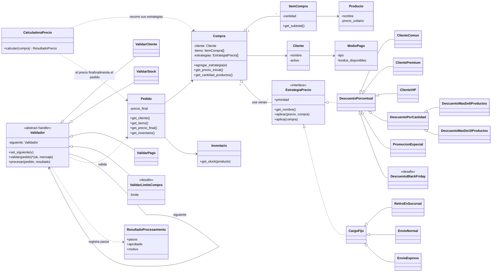

# TP10 - Patrones de Diseño: Strategy + Chain of Responsibility

Sistema para una tienda online que calcula el precio final de una compra (**Strategy**) y luego procesa el pedido a través de una serie de controles (**Chain of Responsibility**).

## Archivos

| Archivo | Contenido |
|---|---|
| `modelos.py` | Clases de dominio: `Producto`, `ItemCompra`, `Cliente`, `MedioPago`, `Inventario`, `Compra`, `Pedido`. |
| `estrategias.py` | **Parte 1**: interfaz `EstrategiaPrecio`, estrategias concretas y `CalculadoraPrecio`. |
| `cadena.py` | **Parte 2**: interfaz `Validador` (handler), `ValidarCliente`, `ValidarStock`, `ValidarPago` y `armar_cadena`. |
| `main.py` | Escenarios: pedido aprobado, rechazado por stock y rechazado por pago. |
| `desafio.py` | `DescuentoBlackFriday` y `ValidarLimiteCompra`, agregados sin tocar el código existente. |

Ejecución (desde esta carpeta): `python main.py` y `python desafio.py`.

## Decisiones de diseño

- **Las estrategias se encadenan sobre el precio actual**: cada descuento se calcula sobre el resultado de la anterior. Ejemplo del enunciado: `100.000 → VIP -15% = 85.000 → cantidad -10% = 76.500 → promo -5% = 72.675 → Express +10.000 = 82.675`.
- **Los descuentos se aplican antes que los cargos de envío** (atributo `prioridad`), para que un descuento porcentual nunca afecte al costo del envío, sin importar el orden en que se agreguen a la compra.
- **Descuentos por cantidad**: "Más de 5 productos" aplica de 6 a 10 unidades y "Más de 10 productos" desde 11, para que no se acumulen. Si una estrategia no corresponde a la compra (`aplica()` devuelve `False`) se informa como "no aplica".
- **Cadena**: `Validar Cliente → Validar Stock → Validar Pago`. Cada validador implementa `validar(pedido)`; si falla, la clase base corta la cadena y registra el motivo; si es correcto, delega en el siguiente.

## Diagrama de clases (UML)



### Relación entre los patrones

```
Compra ──(Strategy)──► CalculadoraPrecio ──► precio final
                                                  │
                                                  ▼
                                               Pedido
                                                  │
        (Chain of Responsibility)                 ▼
   Validar Cliente ─► Validar Stock ─► Validar Pago ─► Pedido aprobado
          │                 │                │
          └─────────────────┴────────────────┴──► Pedido rechazado (corta la cadena)
```

Strategy resuelve **cuánto cuesta** la compra y su resultado (`precio_final`) es el dato de entrada de Chain of Responsibility, que resuelve **si el pedido puede confirmarse**.

