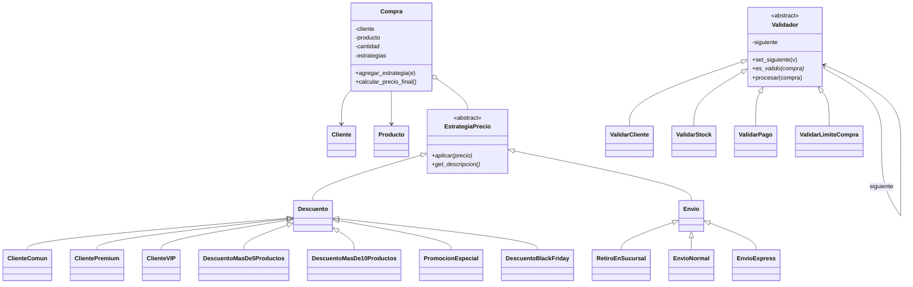

# TP10 - Patrones de Diseño: Strategy + Chain of Responsibility

Tienda online que calcula el precio final de una compra (**Strategy**) y después valida el pedido con una cadena de controles (**Chain of Responsibility**).

## Archivos

| Archivo | Contenido |
|---|---|
| `modelos.py` | `Producto`, `Cliente` y `Compra`. |
| `estrategias.py` | **Parte 1**: clase abstracta `EstrategiaPrecio`, `Descuento`, `Envio` y sus subclases. |
| `cadena.py` | **Parte 2**: clase abstracta `Validador` y `ValidarCliente`, `ValidarStock`, `ValidarPago`. |
| `main.py` | Tres escenarios: aprobado, rechazado por stock y rechazado por pago. |
| `desafio.py` | `DescuentoBlackFriday` y `ValidarLimiteCompra`. |

Para ejecutarlo (desde esta carpeta): `python main.py` y `python desafio.py`.

## Conceptos de POO aplicados

- **Abstracción**: `EstrategiaPrecio` y `Validador` son clases abstractas (`ABC`). Definen *qué* hay que hacer (`aplicar`, `es_valido`), pero no *cómo*.
- **Herencia**: `Descuento` y `Envio` heredan de `EstrategiaPrecio`. `ClienteVIP`, `EnvioExpress` y las demás heredan de ellas y solo pasan su nombre y su valor a `super().__init__`.
- **Polimorfismo**: `Compra` recorre sus estrategias y llama a `aplicar(precio)` sin saber de qué clase es cada una. La cadena llama a `es_valido(compra)` y cada validador responde a su manera.
- **Encapsulamiento**: los atributos de los modelos son privados (`__`) y se accede a ellos con getters.

## Diagrama de clases (UML)



## Cómo se relacionan los patrones

```
Compra ──(Strategy)──► precio final
                           │
                           ▼
Validar Cliente ─► Validar Stock ─► Validar Pago ─► Pedido aprobado
       │                 │                │
       └─────────────────┴────────────────┴──► Pedido rechazado (se corta la cadena)
```

Strategy calcula **cuánto cuesta** la compra y Chain of Responsibility decide **si el pedido se puede confirmar**.
